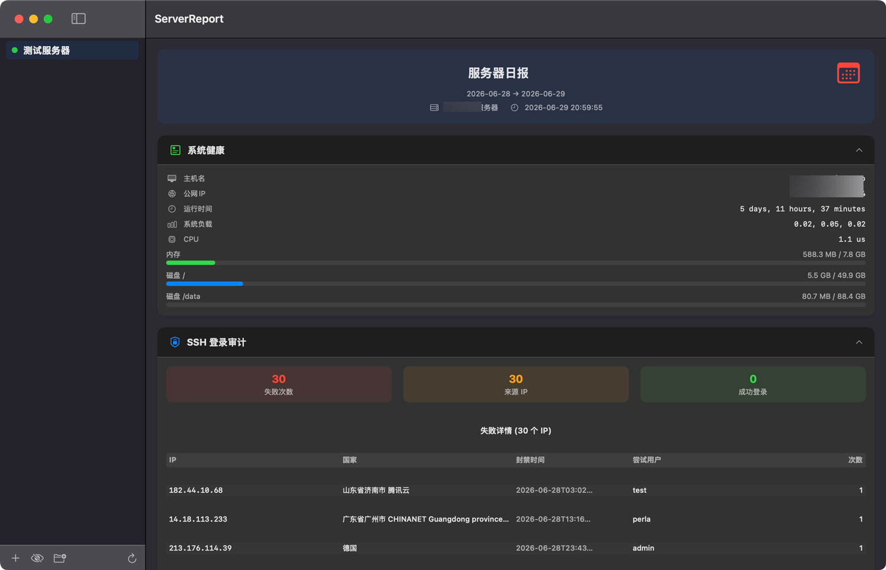
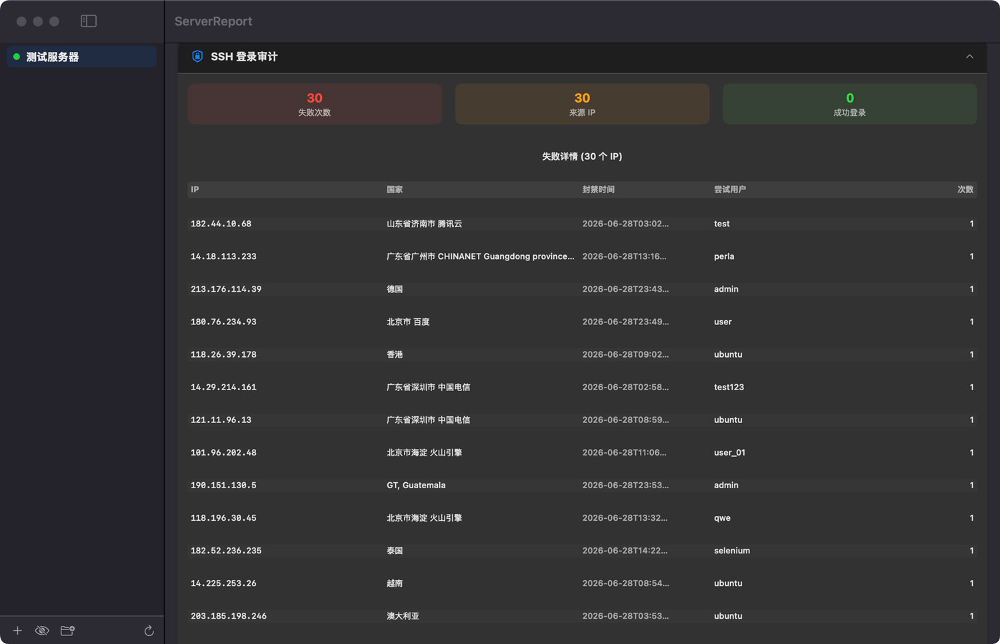
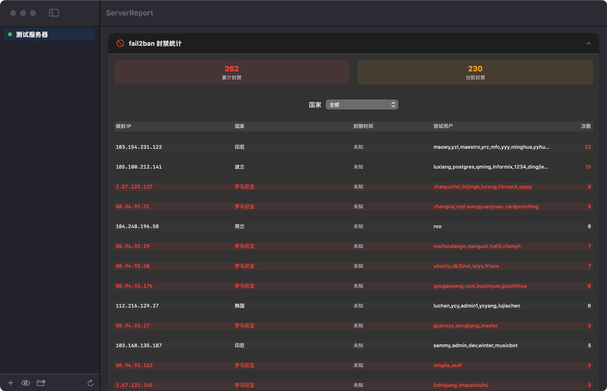
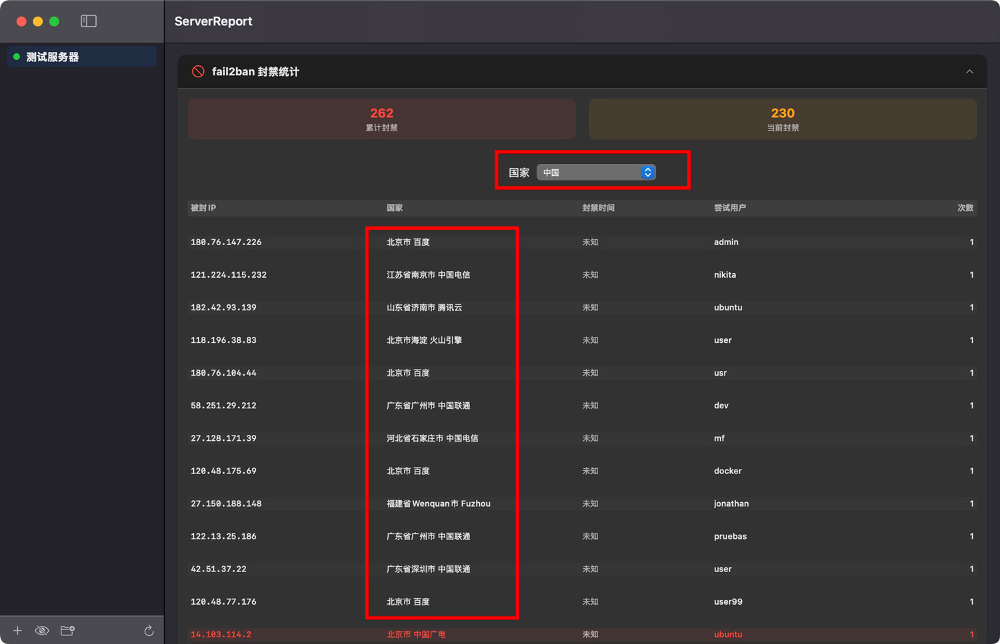
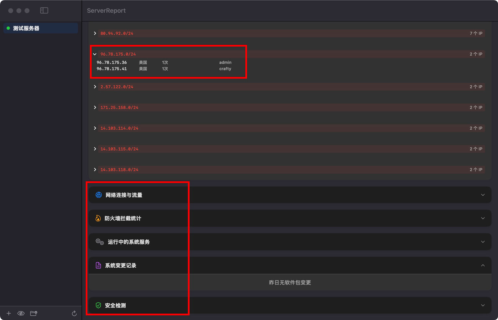

## server-report — Linux 服务器日报程序

每天自动把系统安全状况发送到你的邮箱。支持 SSH 登录审计、fail2ban 封禁统计、IP 归属地中文显示、子网自动封段等功能。

详细说明: <a href="https://rongyan.cc/code/server-report.html" target="_blank">https://rongyan.cc/code/server-report.html</a>

---

## 2026-06-30 更新说明

- 服务端增加 api key 功能，供客户端调用
- 增加 Windows、macOS 客户端（付费）
- 服务端改为**定时采集 + 文件缓存**策略，客户端查询毫秒级响应
- 数据保留 180 天，每天自动清理超期数据
- 服务端源代码、预编译二进制同步更新

---

## 项目结构

```
server-report/
├── go/                          # 服务端 Go 源码
│   ├── main.go                  # 入口（--serve 启动API）
│   ├── config.go                # 配置管理
│   ├── serve.go                 # HTTP API 服务器
│   ├── report_api.go            # 日报数据构建
│   ├── report_json.go           # JSON 数据模型
│   ├── fail2ban.go              # fail2ban 管理 + 地理位置
│   ├── system.go                # 系统信息采集
│   ├── ssh_auth.go              # SSH 审计
│   ├── network.go               # 网络连接分析
│   ├── firewall.go              # 防火墙统计
│   ├── services.go              # 服务列表
│   ├── changes.go               # 系统变更追踪
│   ├── security.go              # 安全检测
│   ├── mail.go                  # 邮件发送
│   ├── subnet.go                # 子网封禁
│   └── util.go                  # 工具函数
├── gosrc/                       # 编译好的服务端二进制程序
│   ├── server-report
│   └── config.yml               # 示例配置
├── Client/                      # 客户端
│   ├── ServerReport.app         # macOS，暂未开源
│   └── ServerReport.exe         # Windows  暂未开源
└── README.md
```

---

## 服务端部署

### 环境要求

- Linux 服务器（x86_64）
- 依赖命令,需提前安装好：`journalctl`、`geoiplookup`、`curl`、`uptime`、`top`、`free`、`df`、`fail2ban-client`
- 推荐安装 `geoip-bin` 用于 IP 地理位置查询

### 安装步骤

**1. 服务器端自行编译**

```bash
cd go
GOOS=linux GOARCH=amd64 go build -o ../data/server-report .
```

```bash
或者直接使用预编译的二进制
/data/server-report
```

**2. 上传到服务器**

```bash
scp server-report root@你的服务器IP:/data/server-report/server-report
scp config.sample.yml root@你的服务器IP:/data/server-report/config.sample.yml
ssh root@你的服务器IP "mv /data/server-report/config.sample.yml /data/server-report/config.yml"
ssh root@你的服务器IP "chmod +x /data/server-report/server-report"
```

**3. 修改配置文件**

程序自带示例配置文件 `config.yml`，上传后按需修改：

```bash
# 编辑配置文件
ssh root@你的服务器IP "vi /data/server-report/config.yml"
```

#### 配置文件说明
| 字段 | 说明 | 默认值 |
|------|------|--------|
| `server.name` | 服务器名称，用于邮件标题 | 必填 |
| `server.ip` | 固定 IP，留空自动获取 | 自动 |
| `server.ssh_port` | SSH 端口 | 22 |
| `server.api_key` | API 认证密钥（建议32位随机字符串） | 必填 |
| `server.api_port` | API 监听端口 | 8080 |
| `smtp.*` | 邮件发送配置 | 必填 |
| `mail.*` | 邮件接收配置 | 必填 |
| `modules.*` | 各功能模块开关 | true |
| `security.fail2ban.maxretry` | 封禁阈值 | 1 |
| `security.fail2ban.bantime` | 封禁时长（秒，-1=永久） | -1 |
| `security.subnet_ban.threshold` | 封段阈值 | 2 |

#### API Key 说明
| 项目 | 说明 |
|------|------|
| 长度要求 | 建议 **32 位** 随机字符串（如 `a1b2c3d4e5f6a7b8c9d0e1f2a3b4c5d6`） |
| 字符范围 | 建议使用大小写字母 + 数字（`a-z`, `A-Z`, `0-9`），不支持中文或特殊符号 |
| 生成方式 | 在服务端 `config.yml` 中手动设置，客户端填相同的值 |
| 用途 | 认证请求来源，防止未授权访问 API |
| 安全性 | api_key 通过 URL 参数传输，建议搭配防火墙 IP 白名单使用 |

#### 生成示例命令：
```bash
# Linux 生成32位随机API Key
tr -dc 'a-zA-Z0-9' < /dev/urandom | fold -w 32 | head -1

# macOS 生成32位随机API Key
openssl rand -hex 16
```

**4. 创建 systemd 服务**

```bash
cat > /etc/systemd/system/server-report-api.service << 'EOF'
[Unit]
Description=Server Report API Service
After=network.target

[Service]
Type=simple
User=root
ExecStart=/data/server-report/server-report --serve
Restart=always
RestartSec=5

[Install]
WantedBy=multi-user.target
EOF

systemctl daemon-reload
systemctl enable server-report-api.service
systemctl start server-report-api.service
```

**5. 验证服务**

```bash
# 查看服务状态
systemctl status server-report-api.service

# 测试 API
curl "http://IP:8080/api/v1/report?key=your-api-key-here"
```

### API 端口放行

如果客户端需要远程连接 API，需在防火墙放行端口：

```bash
ufw allow 8080/tcp     # Ubuntu/Debian
firewall-cmd --add-port=8080/tcp  # CentOS/RHEL
```

### 更新服务端

```bash
# 停止服务
systemctl stop server-report-api.service

# 备份旧版本
mv /data/server-report/server-report /data/server-report/server-report.bak

# 上传新版本
scp server-report-linux root@服务器IP:/data/server-report/server-report
ssh root@服务器IP "chmod +x /data/server-report/server-report"

# 启动服务
systemctl start server-report-api.service
```

### 定时任务（数据采集策略）

服务端每小时自动采集一次系统数据，保存为 `today.json`，客户端查询时直接读文件返回（毫秒级响应）。每天凌晨将前一天数据归档为 `YYYY-MM-DD.json`，保留 180 天。

| 时间 | 任务 | 说明 |
|------|------|------|
| 每小时（0分） | `--save-report` | 采集系统数据更新 `today.json` |
| 每天 00:01 | `--save-report --archive` | 将前一天数据归档为 `YYYY-MM-DD.json` |
| 每天 03:00 | journalctl 清理 | 清理 180 天前的系统日志 |
| 每天 03:00 | 报告文件清理 | 删除 `reports/` 中超过 180 天的 `.json` 文件 |

设置方式（已配置好，无需手动操作）：
```bash
crontab -l
# 输出：
# 0 * * * * /data/server-report/server-report --save-report
# 1 0 * * * /data/server-report/server-report --save-report --archive
# 0 3 * * * /usr/bin/journalctl --vacuum-time=180d --quiet
# 0 3 * * * find /data/server-report/reports -name "*.json" -mtime +180 -delete
```

### 日志管理

服务状态和系统错误日志通过 `journalctl` 管理。每天凌晨 3 点自动清理 180 天前的日志和归档报告文件。

**手动清理：**
```bash
# 清理 180 天前的日志
journalctl --vacuum-time=180d

# 删除旧归档报告
find /data/server-report/reports -name "*.json" -mtime +180 -delete
```

---

## 测试命令

| 命令 | 说明 |
|------|------|
| `server-report --serve` | 启动 API 服务（供客户端调用） |
| `server-report --save-report` | 立即采集一次数据并保存到 `today.json` |
| `server-report --save-report --archive` | 将前一天数据归档为 `YYYY-MM-DD.json` |
| `server-report --run-once` | 立即发送一次邮件日报 |
| `server-report --subnet-scan` | 手动扫描并封禁恶意子网 |
| `server-report --version` | 查看版本 |
| `server-report --help` | 查看帮助 |

---

## 效果说明

日报包含以下内容：
- 系统健康（CPU / 内存 / 磁盘）
- SSH 登录审计（失败统计 + 成功 IP 聚合）
- fail2ban 封禁列表（IP + 归属地 + 尝试用户 + 失败次数）
- 子网自动封段
- 系统服务变更追踪
- 安全检测（SUID / 异常进程 / 系统错误日志）

---

## 客户端

### macOS 客户端

**运行：** 拷贝 `ServerReport.app` 到应用程序目录直接打开即可使用。

**数据存储：** `~/.config/server-report/`
- `servers.json` — 服务器配置列表
- `reports/*.json` — 历史日报缓存

### Windows 客户端

**运行：** 直接双击 `ServerReport.exe`

**数据存储：** 程序所在目录下的 `config/` 文件夹
- `config/servers.json` — 服务器配置列表
- `config/reports/*.json` — 历史日报缓存

**功能列表：**

| 功能 | 说明 |
|------|------|
| 多服务器管理 | 左侧列表添加/编辑/删除多台服务器，右键菜单操作 |
| 日报展示 | 8 个功能区块，数据结构与服务端 API 完全对应 |
| SSH 审计 | 表格展示：IP、国家（归属地）、封禁时间、尝试用户、次数，次数超 10 标红 |
| fail2ban | 累计/当前封禁数，国家下拉筛选，表头可排序（IP/国家/封禁时间/尝试用户/次数），C段子网点击展开 |
| 日历 | 📅 按钮弹出日历，可切换年月，有数据的日期加重颜色背景 |
| 手动刷新 | ↻ 按钮重新拉取日报 |
| 导入数据 | 📂 按钮从目录选择器导入配置和缓存 |
| 显示切换 | 👁 按钮（在 show/hide 间切换）控制服务器列表IP显示 |
| 导出配置 | 右键服务器 → 导出，下载 `servers.json` |
| 关于页面 | 关于窗口，含版本、开发信息、GitHub 链接 |

---

## API 接口

### 获取日报

```
GET /api/v1/report?key=你的API密钥
```

**响应格式：**
```json
{
    "status": "ok",
    "server": "服务器名称",
    "timestamp": "2026-06-29 10:30:00",
    "date": "2026-06-28 → 2026-06-29",
    "sections": [
        {
            "id": "system",
            "title": "系统健康",
            "type": "system",
            "data": {
                "hostname": "...",
                "ip": "...",
                "uptime": "...",
                "load": "...",
                "cpu": "...",
                "memory": { "used": "...", "total": "...", "percent": 0 },
                "disks": [{ "mount": "/", "used": "...", "total": "...", "percent": 0 }]
            }
        },
        {
            "id": "ssh_auth",
            "title": "SSH 登录审计",
            "type": "ssh_auth",
            "data": {
                "failed_total": 0,
                "failed_ips": 0,
                "failed_detail": [{ "ip": "1.2.3.4", "count": 5, "users": ["root"], "first": "...", "last": "...", "location_cn": "中国", "location_en": "China", "location_detail": "广东省广州市" }],
                "success_total": 0,
                "success_list": [{ "ip": "1.2.3.4", "count": 1, "method": "publickey" }]
            }
        },
        {
            "id": "fail2ban",
            "title": "fail2ban 封禁统计",
            "type": "fail2ban",
            "data": {
                "total_banned": 0,
                "current_banned": 0,
                "banned_ips": [{ "ip": "1.2.3.4", "location_cn": "美国", "location_en": "USA", "ban_time": "...", "users": ["root"], "attempts": 10, "subnet": "1.2.3.0/24" }],
                "banned_subnets": [{ "subnet": "1.2.3.0/24", "ip_count": 3 }]
            }
        },
        {
            "id": "network",
            "title": "网络连接与流量",
            "type": "network",
            "data": { "established": 0, "time_wait": 0, "total": 0, "top_conns": [], "listening_ports": [], "traffic": [] }
        },
        {
            "id": "firewall",
            "title": "防火墙拦截统计",
            "type": "firewall",
            "data": { "total_blocks": 0, "top_src": [], "top_dst": [] }
        },
        {
            "id": "services",
            "title": "运行中的系统服务",
            "type": "services",
            "data": { "total": 0, "running": [] }
        },
        {
            "id": "changes",
            "title": "系统变更记录",
            "type": "changes",
            "data": { "packages": [] }
        },
        {
            "id": "security",
            "title": "安全检测",
            "type": "security",
            "data": { "suid_ok": true, "new_users": [], "suspicious": [], "online_users": [], "errors": [] }
        }
    ]
}
```

### 健康检查

```
GET /api/v1/ping?key=你的API密钥
```

---

## 数据存储

### 服务端

- **配置文件：** `/data/server-report/config.yml`
- **日志文件：** 通过 `journalctl` 管理
- **fail2ban 日志：** `/var/log/fail2ban.log`

---

## 常见问题

### 客户端提示"连接失败"或"获取日报失败"

1. 确认服务器 API 端口（默认 8080）在防火墙上已放行
2. 确认客户端填写的 API Key 与服务端 `config.yml` 中的 `api_key` 一致
3. 确认能从客户端网络访问服务器 IP 和端口：`telnet 服务器IP 8080`
4. 服务端每小时自动采集数据，客户端查询为毫秒级响应；如果刚好在第一小时部署还未生成缓存，会实时采集一次（约20-30秒），之后即可秒回

### 客户端找不到配置文件

macOS：`~/.config/server-report/servers.json`
Windows：程序目录下的 `config/servers.json`

使用"导入数据"功能（📂 按钮）可从备份目录恢复配置和日报缓存。

---

## 客户端示例图片


**客户端主体界面**


**SSH登陆审计封禁列表**


**fail2ban封禁列表**


**针对中国IP单独进行了市级显示**


**IP-C段封禁效果以及其它模块**

MIT License
